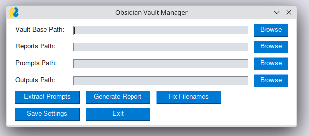
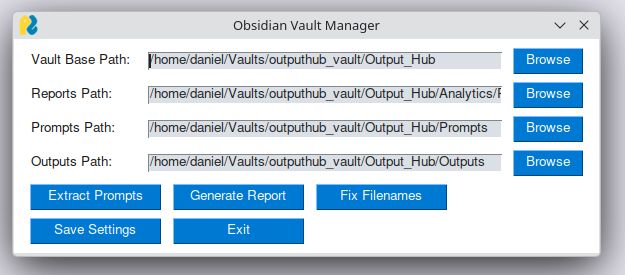
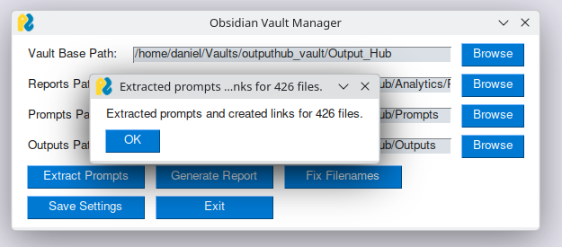
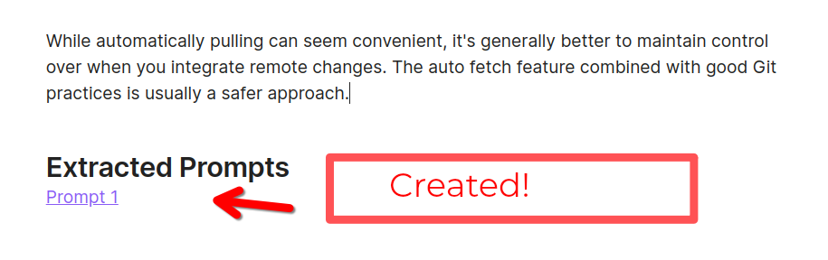
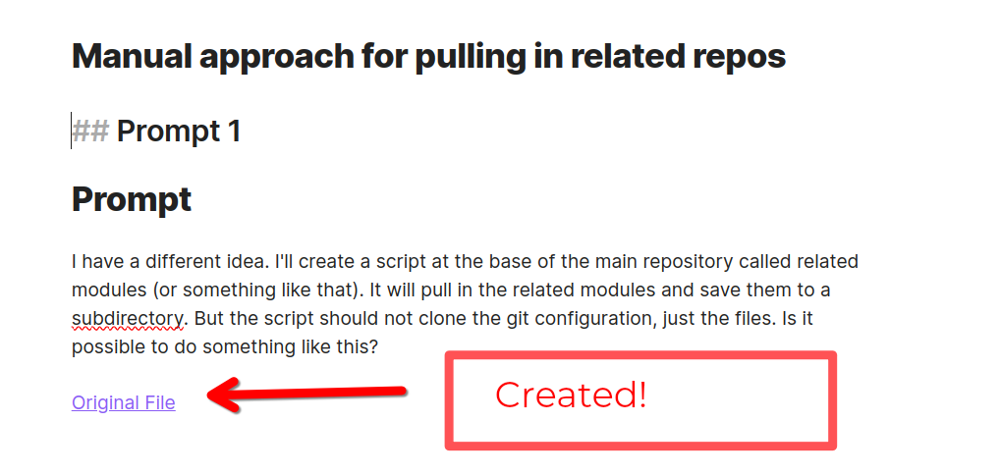
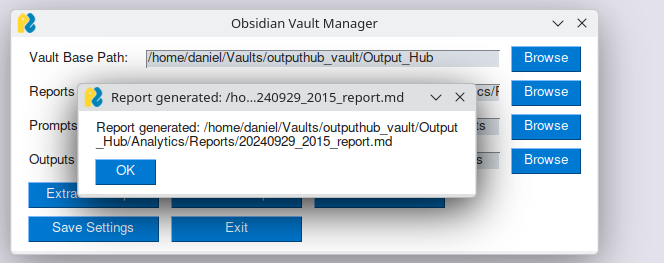
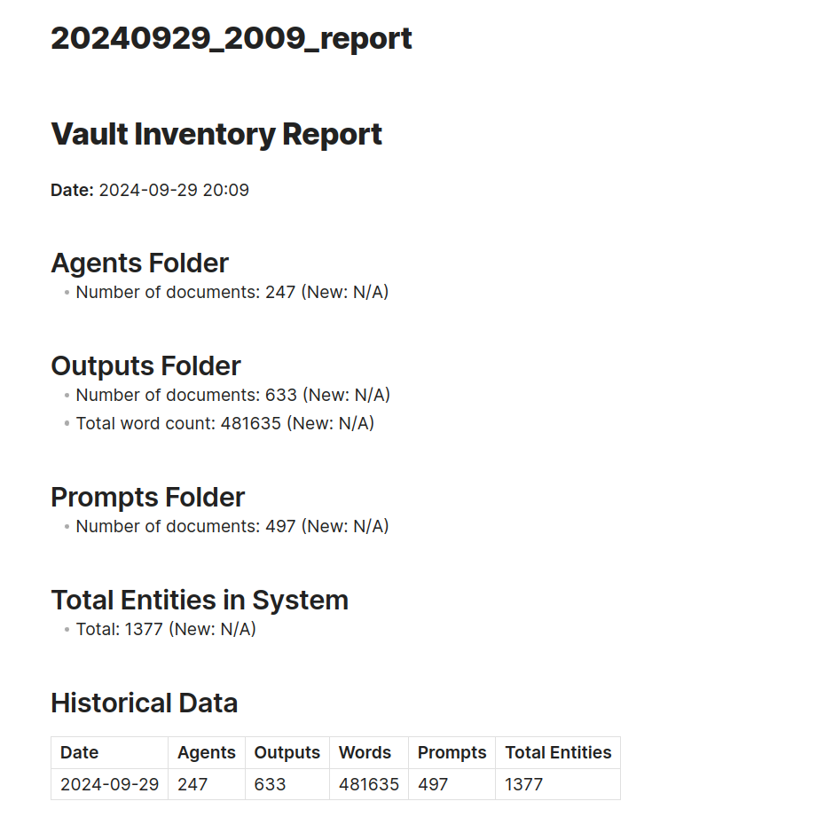
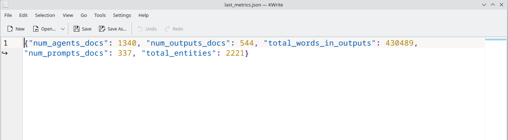
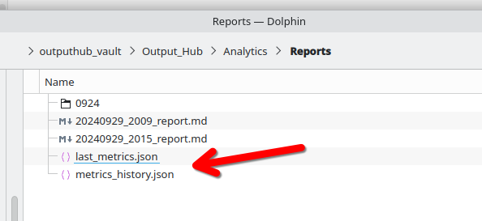

# Obisidian Vault Management GUI

## Purpose Statement

Simple Python GUI for performing management actions over an Obsidian vault optimised and configured for storing LLM outputs.

## Screenshots, V1

### GUI Appearance

---

---

### Automatic prompt extraction (copies prompts into prompts folder)

---

### Automatic bidirectional link creation between prompts and outputs

#### "Extracted prompts" are appended to outputs

---

#### Prompts also link to the outputs generated from them

---

### Create reports to track growth of prompt and output storage vault

---

### Report Format

---

### Simple JSON Files Store Metrics History Within The Vault

## Use Case Statement

## Author

Daniel Rosehill  
(public at danielrosehill dot com)

## Licensing

This repository is licensed under CC-BY-4.0 (Attribution 4.0 International) 
[License](https://creativecommons.org/licenses/by/4.0/)

### Summary of the License
The Creative Commons Attribution 4.0 International (CC BY 4.0) license allows others to:
- **Share**: Copy and redistribute the material in any medium or format.
- **Adapt**: Remix, transform, and build upon the material for any purpose, even commercially.

The licensor cannot revoke these freedoms as long as you follow the license terms.

#### License Terms
- **Attribution**: You must give appropriate credit, provide a link to the license, and indicate if changes were made. You may do so in any reasonable manner, but not in any way that suggests the licensor endorses you or your use.
- **No additional restrictions**: You may not apply legal terms or technological measures that legally restrict others from doing anything the license permits.

For the full legal code, please visit the [Creative Commons website](https://creativecommons.org/licenses/by/4.0/legalcode).